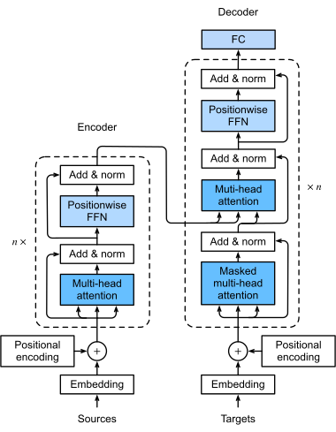

# machine_translation_en2zh
使用Pytorch手写实现原始Transformer训推流程，实现英文-中文机器翻译模型。

## NLP基本流程概述

- 停用词：类似a, an这些可能在上下文中无实际含义的词，需要人工进行挑选。
- one-hot编码缺陷：编码出来的词向量全部正交，无法表达词之间的相似关系，以及上下文关系。
- 词嵌入：利用人工神经网络捕捉词之间相似关系以及上下文关系，word2vec是具体的实现方式。

## seq2seq问题
原始循环神经网络（RNN）要求输入序列与输出序列等长，这在很多场景下几乎不可能实现（比如机器翻译）；
于是一类Encoder-Decoder模型被提出来解决该问题，LSTM、GRU、Transformer是该类模型的具体实现。


## Transformer基本结构
### 1. 整体结构

> 注意，解码器中，第2个multi-head注意力块（此即为交叉注意力）输入为：  
> Q = 解码器前一multi-head注意力块输出；  
> K = 编码器输出；
> V = 编码器输出。
### 2. 词嵌入与位置编码
- 词嵌入
> 可以单独使用word2vec等方式进行词嵌入，也可以与位置编码结合为一个神经网络统一学习，得到词嵌入+位置编码模型。
- 位置编码
> - 目的：Transformer注意力机制是位置不敏感的（即""与"Fish"），需要提取并标记文本上下文特征。
> - 绝对位置编码
> > - **在词向量进入注意力机制前执行**。
> > - 与输入序列无关，为输入序列里每个元素添加**唯一的位置向量**，表征其在序列内的绝对位置。
> > - 优点：计算简单；
> > - 缺点：处理**变长序列**或**长距离依赖**时，可能无法表征复杂的上下文关系。
> - 相对位置编码
> > - **需要与注意力得分结合，在注意力机制中执行**。
> > - 与输入序列有关，只关注输入序列中各元素之间的相对位置。
> > - 优点：解决了绝对位置编码的缺点；
> > - 缺点：计算复杂。
### 3. 注意力机制
- Q（Query）、K（Key）、V（Value）的理解 
> - Q是当前输入词的向量表示；
> - K与V构成查询缓存，每个词作为value，有自己的key；该缓存近似dict，但并不是严格的哈希关系；
> - 注意力机制计算过程：查询K中是否有与输入Q相似的特征向量，若有则从V中取出对应的词向量特征；
> - 注意力机制计算得到的注意力分数与V的乘积，反映了输入数据中各部分的相对重要性。
- 缩放点积注意力（Scaled Dot-Product Attention）

> - 缩放的目的：避免向量维度过大时，点积可能产生的梯度爆炸。  
> - 梯度消失：网络前几层导数值较小，由于求导链式法则导致后续层梯度越来越小，模型难以训练；使用残差块可缓解。
> - 梯度爆炸：网络前几层导数值太大，由于求导链式法则导致后续层梯度越来越大，模型难以训练；进行正则化可缓解。
- 自注意力（Self Attention）
> Q == K == V
- 交叉注意力（Cross Attention）
> Q = 解码器产生的Q，  
> K、V = 编码器产生的K、V
- 多头注意力（Multi-head Attention）

> 将Q、K、V拆分为多个的作用：将注意力机制提取到的高维特征进一步划分，形成多个子语义空间，使得模型可以关注不同维度的语义特征。
- 掩码（mask）
> - 因果掩码（causal mask）：防止解码器在训练时看到未来信息
> > 示例掩码矩阵
> > ```python
> > mask = [
> >       [1, 0, 0, 0],  # 第1个词只能看到自己
> >       [1, 1, 0, 0],  # 第2个词可以看到前2个词
> >       [1, 1, 1, 0],  # 第3个词可以看到前3个词
> >       [1, 1, 1, 1],  # 第4个词可以看到全部词
> >     ]
> > ```
> - padding掩码（padding mask）：解码器与编码器输入序列不等长时，忽略输入序列中的填充符号（如 <pad>），防止模型关注无效位置
### 4. 残差块（Residual Block）
- 在Transformer结构中的位置：Add & Norm处
- 结构：Norm(残差块输出 = 残差块输入 + 残差块内其他层输出)
- 作用：可以避免梯度消失。
### 5. 前馈神经网络（FFN，Feed Forward Network）
简单的线性层结构。

## Checkpoint机制
- 实现：在训练时，每隔一定的epoch就保存一次当前模型的参数和状态。
- 作用：当训练过程意外停止，可以从中断处开始训练，而不用从头开始。
- 效果


## 训推流程
### 1. 训练

### 2. 推理

